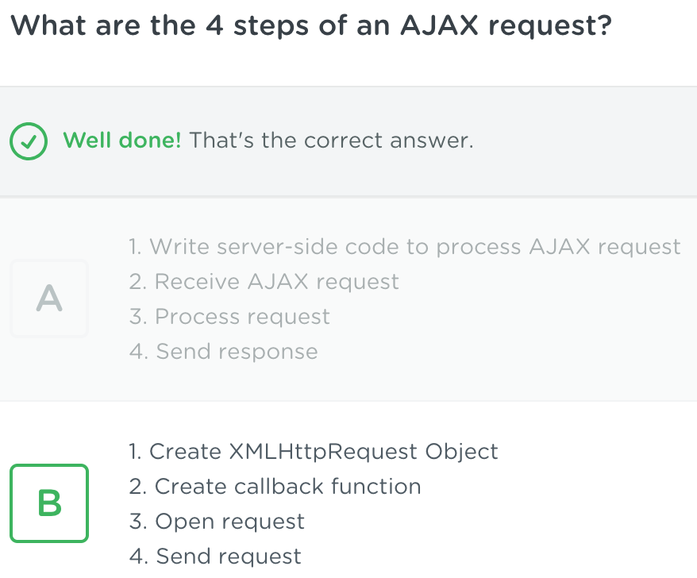

1.markdowntext

https://github.com/marktext/marktext/blob/master/doc/i18n/zh_cn.md#readme

2.tfjs

https://github.com/tensorflow/tfjs

3.ajax

### [AJAX Basics](https://teamtreehouse.com/library/ajax-basics)

https://teamtreehouse.com/library/create-an-xmlhttprequest-object




In the app.js file, create a variable named`request`and assign it a new`XMLHttpRequest`object.

` var request = new XMLHttpRequest();`

插播--Markdown要三个`然后enter  code部分

学习链接

- 支持[CommonMark Spec](https://spec.commonmark.org/0.28/)和[GitHub Flavored Markdown Spec](https://github.github.com/gfm/)语法格式，生成的 Markdown 可以复制到任何支持 markdown 格式的社区、网站。


```javascript
var request = new XMLHttpRequest();
request.onreadystatechange = function () {
  if (request.readyState === 4) {
    document.getElementById("footer").innerHTML = request.responseText;
  }
};
request.open('GET','footer.html');
request.send();
```


